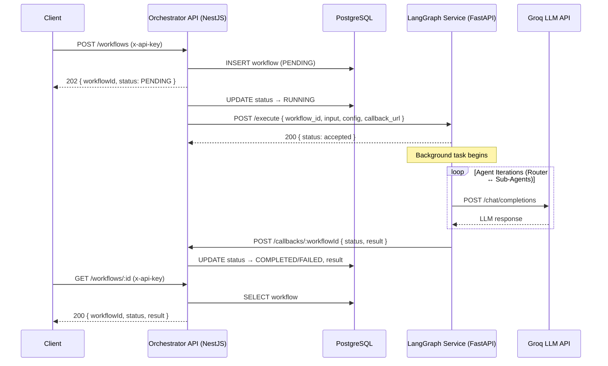
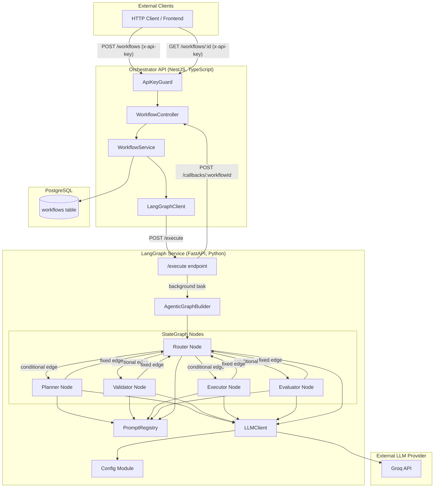
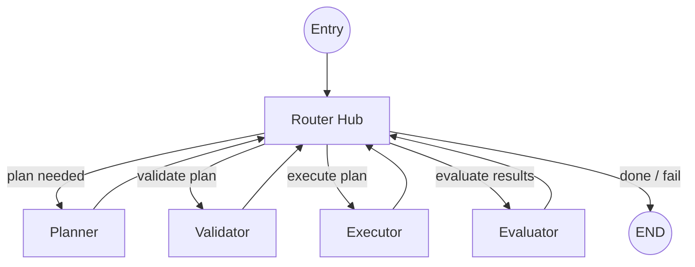
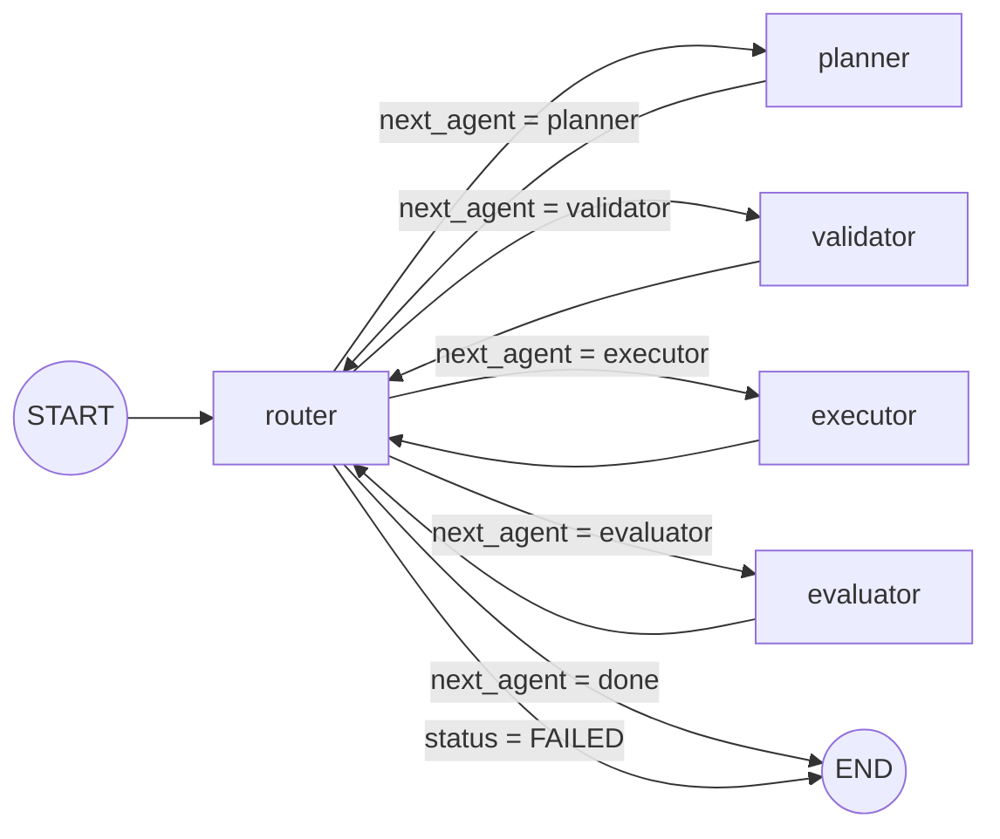
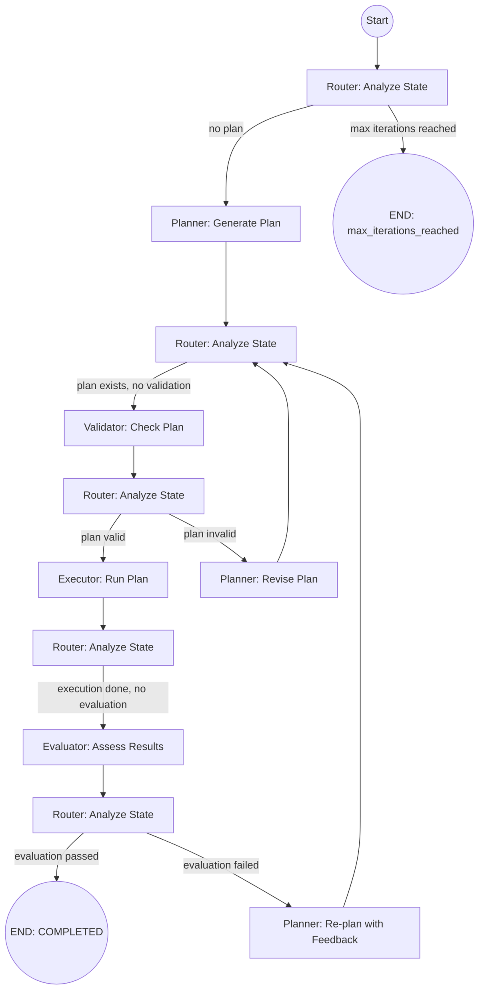
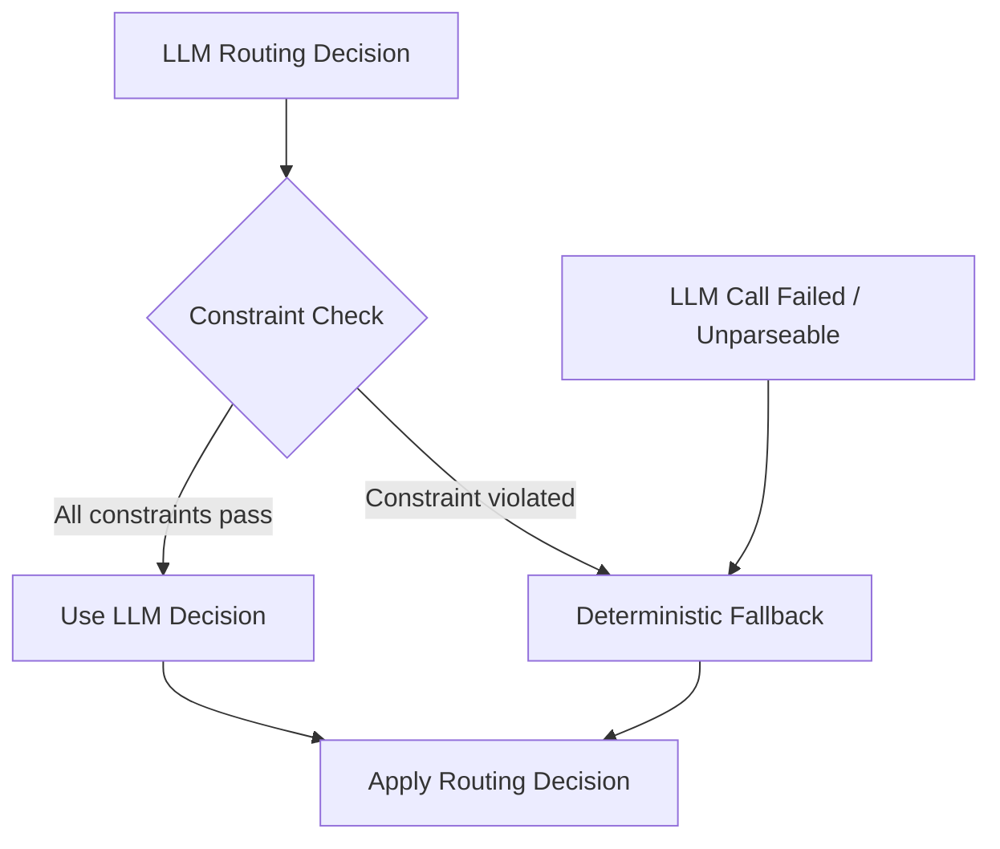
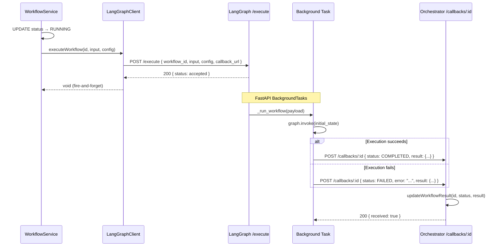
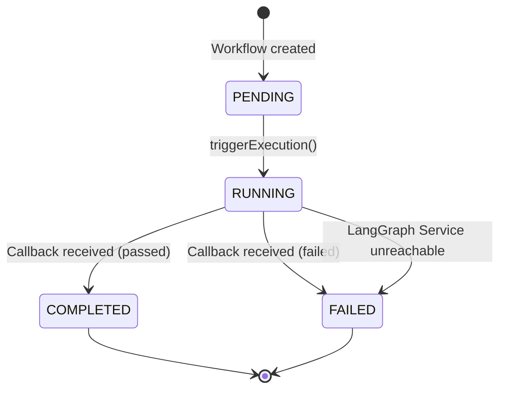
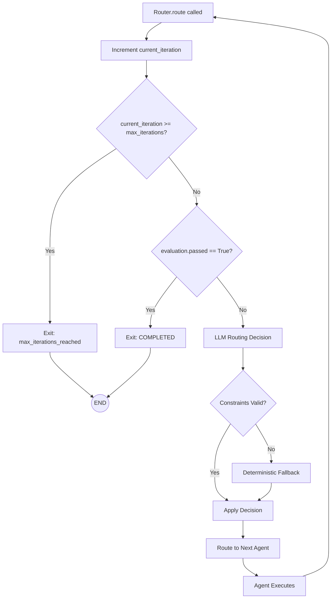

# Architecture and Design: Agentic Workflow Orchestrator

This document provides a comprehensive explanation of the system architecture, design theory, and theoretical foundations of the Agentic Workflow Orchestrator. It covers the two-service topology, the hub-and-spoke agent orchestration pattern, the LangGraph StateGraph execution model, sub-agent contracts, routing strategies, asynchronous communication, state machine semantics, and safety mechanisms.

---

## Table of Contents

1. [System Topology](#1-system-topology)
2. [Hub-and-Spoke Agent Orchestration Pattern](#2-hub-and-spoke-agent-orchestration-pattern)
3. [LangGraph StateGraph Model](#3-langgraph-stategraph-model)
4. [Sub-Agent Roles and Contracts](#4-sub-agent-roles-and-contracts)
5. [Deterministic Fallback Routing and Constraint Enforcement](#5-deterministic-fallback-routing-and-constraint-enforcement)
6. [Callback-Based Asynchronous Communication](#6-callback-based-asynchronous-communication)
7. [Workflow State Machine](#7-workflow-state-machine)
8. [Retry and Iteration-Limiting Mechanisms](#8-retry-and-iteration-limiting-mechanisms)

---

## 1. System Topology

The Agentic Workflow Orchestrator is composed of two independently deployable services that communicate over HTTP, plus external dependencies for persistence and LLM inference.

### 1.1 Service Overview

| Service | Language | Framework | Role |
|---|---|---|---|
| **Orchestrator API** | TypeScript | NestJS + TypeORM | Client-facing REST API. Accepts workflow submissions, persists state in PostgreSQL, delegates execution to the LangGraph Service, and receives completion callbacks. |
| **LangGraph Service** | Python | FastAPI + LangGraph | Agent execution engine. Runs the multi-agent state graph, makes LLM calls via the Groq API, and sends a single callback to the Orchestrator API when execution finishes. |

### 1.2 Communication Patterns

There are three distinct communication channels in the system:

1. **Client → Orchestrator API** (synchronous request/response): External clients submit workflows and poll for status via REST endpoints protected by API key authentication (`x-api-key` header validated by `ApiKeyGuard`).
2. **Orchestrator API → LangGraph Service** (fire-and-forget POST): The Orchestrator API sends an execution payload to the LangGraph Service's `/execute` endpoint. The LangGraph Service responds immediately with an acknowledgement; actual execution happens in a FastAPI `BackgroundTasks` task.
3. **LangGraph Service → Orchestrator API** (asynchronous callback): When execution completes (success or failure), the LangGraph Service sends a single HTTP POST to the Orchestrator API's `/callbacks/:workflowId` endpoint with the final status and result.



### 1.3 Data Flow Summary

The execution payload sent from the Orchestrator API to the LangGraph Service contains:

| Field | Type | Description |
|---|---|---|
| `workflow_id` | `string` | UUID identifying the workflow |
| `input` | `object` | Arbitrary JSON payload describing the task |
| `config` | `object` | Execution parameters: `maxRetries`, `maxIterations`, `timeoutSeconds`, optional `model` |
| `callback_url` | `string` | Full URL for the completion callback (e.g., `http://localhost:3000/callbacks/<uuid>`) |

The callback payload sent back contains:

| Field | Type | Description |
|---|---|---|
| `status` | `"COMPLETED" \| "FAILED"` | Terminal workflow status |
| `result` | `object \| null` | Contains `plan`, `validationResult`, `executionOutput`, `evaluation`, `routingHistory`, `totalIterations`, `finalOutput` |
| `error` | `string` (optional) | Error message when status is FAILED |

### 1.4 Component Diagram



---

## 2. Hub-and-Spoke Agent Orchestration Pattern

### 2.1 Pattern Description

The system uses a **hub-and-spoke** (also called **star topology**) orchestration pattern. A central **Router** node acts as the hub, and four specialized **sub-agents** (Planner, Validator, Executor, Evaluator) act as spokes. Every transition between agents passes through the Router.



### 2.2 Why Hub-and-Spoke Over a Fixed Sequential Pipeline

A naive approach to multi-agent orchestration is a **fixed sequential pipeline**: Planner → Validator → Executor → Evaluator → Done. While simple, this design has critical limitations that the hub-and-spoke pattern overcomes:

| Concern | Fixed Pipeline | Hub-and-Spoke (This System) |
|---|---|---|
| **Re-planning after failed validation** | Requires explicit backward edges or restart logic. The pipeline becomes a tangled graph of special-case transitions. | The Router naturally routes back to the Planner when validation fails. No special edges needed — the Router simply picks the right agent. |
| **Re-planning after failed evaluation** | Same problem — the pipeline must encode every possible "go back" transition. | The Router reads the evaluation feedback and decides whether to re-plan, re-execute, or terminate. The Planner's `_build_prompt` method includes previous evaluation feedback when retrying. |
| **Skipping unnecessary stages** | Every stage runs even when not needed (e.g., re-validation after a minor plan tweak). | The Router can skip stages. If the LLM determines the plan is still valid after a minor revision, it can route directly to the Executor. |
| **Adaptive behavior** | Behavior is hardcoded at build time. | The Router uses LLM reasoning to make context-aware decisions at runtime. Each routing decision includes a `reasoning` field and `confidence` score. |
| **Extensibility** | Adding a new agent requires rewiring the entire pipeline. | Adding a new spoke agent requires only: (1) adding a node, (2) adding it to the Router's valid agents set, and (3) adding the conditional edge mapping. |
| **Observability** | Transition history is implicit in execution order. | Every routing decision is recorded in `routing_history` with `next_agent`, `reasoning`, and `confidence`, providing a full audit trail. |

### 2.3 The Router as an LLM-Powered Decision Maker

The `OrchestratorRouter` (defined in `langgraph-service/app/workflow/router.py`) is not a simple rule engine — it is an LLM-powered decision maker that receives a summary of the current `WorkflowState` and returns a structured routing decision.

The Router's `route()` method follows this decision hierarchy:

1. **Hard termination checks** (no LLM call needed):
   - If `current_iteration >= max_iterations` → route to `done` with status `max_iterations_reached`
   - If `evaluation.passed == True` → route to `done` with status `COMPLETED`

2. **LLM-based routing** (primary path):
   - Build a prompt summarizing the current state (plan status, validation status, execution status, evaluation status, iteration count)
   - Call the LLM to get a `RoutingDecision` with `next_agent`, `reasoning`, and `confidence`
   - Apply constraint enforcement to the LLM's decision (see Section 5)

3. **Deterministic fallback** (safety net):
   - If the LLM call fails or returns an unparseable response, fall back to a purely deterministic routing strategy based on which state fields are populated (see Section 5)

This layered approach ensures the system benefits from LLM intelligence when available but never gets stuck when the LLM misbehaves.

### 2.4 Routing Decision Data Structure

Every routing decision is captured as a `RoutingDecision` TypedDict:

```python
class RoutingDecision(TypedDict):
    next_agent: str       # One of: "planner", "validator", "executor", "evaluator", "done"
    reasoning: str        # Human-readable explanation of why this agent was chosen
    confidence: float     # 0.0 to 1.0 confidence score
```

These decisions accumulate in the `routing_history` list within `WorkflowState`, providing a complete trace of every routing decision made during the workflow's lifetime.

---

## 3. LangGraph StateGraph Model

### 3.1 What is a StateGraph?

LangGraph's `StateGraph` is a directed graph execution framework where:

- **Nodes** are Python callables (functions or methods) that receive the current state and return a new state.
- **Edges** define transitions between nodes. There are two types:
  - **Fixed edges**: Unconditional transitions (e.g., "after Planner, always go to Router").
  - **Conditional edges**: Transitions determined by a routing function that inspects the current state and returns a string key mapped to a target node.
- **State** is a `TypedDict` that flows through the graph. Each node receives the full state and returns an updated copy. LangGraph merges the returned dict into the running state.

### 3.2 Graph Construction in This Project

The graph is built by `AgenticGraphBuilder.build()` in `langgraph-service/app/workflow/graph.py`. Here is the exact construction logic:

```python
graph = StateGraph(WorkflowState)

# --- Five nodes ---
graph.add_node("router",    router.route)       # OrchestratorRouter.route
graph.add_node("planner",   planner.run)         # PlannerAgent.run
graph.add_node("validator",  validator.run)       # ValidatorAgent.run
graph.add_node("executor",   executor.run)        # ExecutorAgent.run
graph.add_node("evaluator",  evaluator.run)       # EvaluatorAgent.run

# --- Entry point ---
graph.set_entry_point("router")

# --- Conditional edges from Router ---
graph.add_conditional_edges(
    "router",
    route_from_router,    # Routing function
    {
        "planner":   "planner",
        "validator":  "validator",
        "executor":   "executor",
        "evaluator":  "evaluator",
        "done":       END,
        "fail":       END,
    },
)

# --- Fixed edges: every agent returns to Router ---
graph.add_edge("planner",   "router")
graph.add_edge("validator",  "router")
graph.add_edge("executor",   "router")
graph.add_edge("evaluator",  "router")
```

### 3.3 Graph Topology Diagram



### 3.4 The Conditional Edge Function

The `route_from_router` function is the conditional edge resolver. It inspects the state after the Router node executes and returns a string key that maps to the next node:

```python
def route_from_router(state: WorkflowState) -> str:
    if state.get("status") == "FAILED":
        return "fail"
    return state["next_agent"]
```

This function handles two cases:
- If the Router (or a previous agent) set `status` to `"FAILED"`, the graph terminates via the `"fail"` → `END` mapping.
- Otherwise, it returns the `next_agent` string set by the Router, which maps to the corresponding node.

### 3.5 State Propagation Model

LangGraph uses a **merge-on-return** state propagation model:

1. The graph starts with an `initial_state` dict (constructed in `_run_workflow` in `routes.py`).
2. The entry node (`router`) receives the full state.
3. The node returns a new dict. LangGraph merges the returned keys into the running state (shallow merge — returned keys overwrite existing keys).
4. The next node receives the merged state.
5. This continues until the graph reaches `END`.

Agents in this project follow the convention of returning `{**state, "key": new_value}` — a full copy with specific fields updated. This ensures immutability of the input state within each node.

### 3.6 WorkflowState Schema

The complete state schema (defined in `langgraph-service/app/models/state.py`):

```python
class WorkflowState(TypedDict):
    workflow_id: str                          # UUID from the Orchestrator API
    input: dict                               # Original workflow input payload
    config: dict                              # Execution config (maxRetries, maxIterations, model, etc.)
    plan: Optional[list[PlanStep]]            # Output of PlannerAgent
    validation: Optional[ValidationResult]    # Output of ValidatorAgent
    execution: Optional[ExecutionOutput]      # Output of ExecutorAgent
    evaluation: Optional[EvaluationResult]    # Output of EvaluatorAgent
    routing_history: list[RoutingDecision]    # Audit trail of all routing decisions
    current_iteration: int                    # How many times the Router has executed
    max_iterations: int                       # Upper bound on Router executions
    next_agent: Optional[str]                 # Router's decision for the next node
    retry_count: int                          # Number of retries consumed
    max_retries: int                          # Upper bound on retries
    status: str                               # Current workflow status string
    error: Optional[str]                      # Error message if something failed
```

### 3.7 Initial State Construction

When a workflow execution begins, the initial state is constructed in `_run_workflow()` (`langgraph-service/app/api/routes.py`):

```python
initial_state: WorkflowState = {
    "workflow_id": payload.workflow_id,
    "input": payload.input,
    "config": config,
    "plan": None,
    "validation": None,
    "execution": None,
    "evaluation": None,
    "routing_history": [],
    "current_iteration": 0,
    "max_iterations": config.get("maxIterations", DEFAULT_MAX_ITERATIONS),
    "next_agent": None,
    "retry_count": 0,
    "max_retries": config.get("maxRetries", DEFAULT_MAX_RETRIES),
    "status": "initialized",
    "error": None,
}
```

All agent output fields (`plan`, `validation`, `execution`, `evaluation`) start as `None`. The Router uses the presence or absence of these fields to determine which agent should run next.

---

## 4. Sub-Agent Roles and Contracts

All four sub-agents inherit from `BaseAgent` (`langgraph-service/app/agents/base.py`), which provides:

- **LLM call abstraction** via `_call_llm(state, prompt)` with model resolution precedence: workflow config `model` > per-agent env var > `DEFAULT_MODEL` > hardcoded fallback `"llama-3.3-70b-versatile"`.
- **JSON parsing** via `_parse_json(text)` that handles markdown fences and surrounding prose.
- **Failure handling** via `_fail(state, error)` that returns a new state with `status: "FAILED"` and the error message.
- **Prompt loading** via an optional `PromptRegistry` instance that loads templates from `langgraph-service/prompts/`.

Each agent's `run(state)` method follows the same pattern:
1. Build a prompt from the current state (using `PromptRegistry` or inline fallback).
2. Call the LLM via `_call_llm()`.
3. Parse the structured JSON response.
4. Return a new state with the agent's output field populated.

### 4.1 PlannerAgent

**Purpose**: Breaks the workflow input into discrete, ordered execution steps.

**When invoked**: At the start of a workflow (no plan exists) or when re-planning is needed (evaluation failed and the Router decides to re-plan).

**Input contract** (reads from state):

| Field | Required | Description |
|---|---|---|
| `input` | Yes | The original workflow input payload |
| `evaluation` | No | If present and `passed == False`, the Planner includes the evaluation `feedback` in its prompt so it can revise the plan |

**Output contract** (writes to state):

| Field | Type | Description |
|---|---|---|
| `plan` | `list[PlanStep]` | Ordered list of plan steps |
| `status` | `str` | Set to `"planning_complete"` on success, `"FAILED"` on failure |

**PlanStep structure**:

```python
class PlanStep(TypedDict):
    step_id: str            # Unique identifier for the step (e.g., "1", "2")
    description: str        # What the step should do
    expected_output: str    # What the step should produce
```

**Re-planning behavior**: When the Planner detects a previous failed evaluation (`evaluation.passed == False`), it appends the evaluation feedback to its prompt under a "Previous Evaluation Feedback" section. This allows the LLM to learn from past failures and produce a revised plan.

**Prompt template** (`prompts/planner.txt`):
```
You are a planning agent. Break the following workflow input into discrete execution steps.

## Workflow Input
{input}
{evaluation_section}
Respond with ONLY a JSON array of plan steps...
```

### 4.2 ValidatorAgent

**Purpose**: Reviews the current plan for feasibility, completeness, and constraint satisfaction before execution.

**When invoked**: After the Planner produces or revises a plan.

**Input contract** (reads from state):

| Field | Required | Description |
|---|---|---|
| `input` | Yes | The original workflow input (for context) |
| `plan` | Yes | The plan to validate |

**Output contract** (writes to state):

| Field | Type | Description |
|---|---|---|
| `validation` | `ValidationResult` | Validation outcome |
| `status` | `str` | Set to `"validation_complete"` on success, `"FAILED"` on failure |

**ValidationResult structure**:

```python
class ValidationResult(TypedDict):
    is_valid: bool      # Whether the plan passes validation
    issues: list[str]   # List of issues found (empty if valid)
```

**Validation failure flow**: When `is_valid == False`, the Router's deterministic fallback routes back to the Planner for re-planning. The constraint enforcement logic in the Router prevents the Executor from running on an invalid plan.

**Prompt template** (`prompts/validator.txt`):
```
You are a validation agent. Review the following execution plan and determine if it is valid and feasible.

## Workflow Input
{input}

## Plan to Validate
{plan}

Respond with ONLY a JSON object...
```

### 4.3 ExecutorAgent

**Purpose**: Executes each step of the validated plan and produces structured results.

**When invoked**: After the Validator confirms the plan is valid (`validation.is_valid == True`).

**Input contract** (reads from state):

| Field | Required | Description |
|---|---|---|
| `input` | Yes | The original workflow input |
| `plan` | Yes | The validated plan to execute |

**Output contract** (writes to state):

| Field | Type | Description |
|---|---|---|
| `execution` | `ExecutionOutput` | Execution results |
| `status` | `str` | Set to `"execution_complete"` on success, `"FAILED"` on failure |

**ExecutionOutput structure**:

```python
class ExecutionOutput(TypedDict):
    step_results: list[dict]   # Per-step results with step_id, output, status
    success: bool              # True if all steps succeeded
```

**Prompt template** (`prompts/executor.txt`):
```
You are an execution agent. Execute each step of the validated plan and produce results.

## Workflow Input
{input}

## Validated Plan
{plan}

Respond with ONLY a JSON object...
```

### 4.4 EvaluatorAgent

**Purpose**: Assesses the execution results against the original workflow input and plan to determine if the workflow succeeded.

**When invoked**: After the Executor produces execution output.

**Input contract** (reads from state):

| Field | Required | Description |
|---|---|---|
| `input` | Yes | The original workflow input |
| `plan` | Yes | The plan that was executed |
| `execution` | Yes | The execution output to evaluate |

**Output contract** (writes to state):

| Field | Type | Description |
|---|---|---|
| `evaluation` | `EvaluationResult` | Evaluation outcome |
| `status` | `str` | Set to `"evaluation_complete"` on success, `"FAILED"` on failure |

**EvaluationResult structure**:

```python
class EvaluationResult(TypedDict):
    passed: bool       # Whether the execution meets success criteria
    score: float       # Quality score from 0.0 to 1.0 (clamped)
    feedback: str      # Detailed feedback explaining the evaluation
```

**Evaluation outcome flow**:
- If `passed == True`: The Router detects this on the next iteration and terminates the workflow with status `"COMPLETED"`.
- If `passed == False`: The Router may route back to the Planner for re-planning, using the `feedback` field to guide the revision. This creates the iterative improvement loop that is central to the system's design.

**Prompt template** (`prompts/evaluator.txt`):
```
You are an evaluation agent. Assess the execution results against the original workflow input and plan.

## Workflow Input
{input}

## Plan
{plan}

## Execution Output
{execution}

Respond with ONLY a JSON object...
```

### 4.5 Agent Interaction Flow Diagram



---

## 5. Deterministic Fallback Routing and Constraint Enforcement

The Router employs a two-layer safety system to ensure the workflow never enters an invalid state, even when the LLM produces incorrect or unparseable routing decisions.

### 5.1 Constraint Enforcement Rules

After the LLM returns a routing decision, the Router applies **constraint enforcement** via `_enforce_constraints()`. These rules prevent logically impossible transitions:

| Constraint | Rule | Rationale |
|---|---|---|
| **No validation without a plan** | If `next_agent == "validator"` and `state.plan` is `None` → reject decision | The Validator cannot validate a non-existent plan |
| **No execution without valid validation** | If `next_agent == "executor"` and (`state.validation` is `None` or `validation.is_valid == False`) → reject decision | The Executor must only run on validated plans |
| **No evaluation without execution** | If `next_agent == "evaluator"` and `state.execution` is `None` → reject decision | The Evaluator cannot assess non-existent execution results |

When a constraint is violated, the LLM's decision is discarded and the system falls through to the deterministic fallback.



### 5.2 Deterministic Fallback Strategy

The `_deterministic_fallback()` method implements a purely state-driven routing strategy. It examines which fields in the `WorkflowState` are populated and routes to the next logical agent:

```
if no plan exists           → route to Planner
if no validation exists     → route to Validator
if validation failed        → route to Planner (re-plan)
if no execution exists      → route to Executor
if no evaluation exists     → route to Evaluator
if all fields populated     → route to "done"
```

This creates a natural progression: **Planner → Validator → Executor → Evaluator → Done**, with automatic re-planning when validation fails. The fallback always produces a valid `RoutingDecision` with `confidence: 1.0`.

### 5.3 Decision Hierarchy

The complete routing decision hierarchy in `OrchestratorRouter.route()`:

```
1. Hard termination: max_iterations reached?     → done (max_iterations_reached)
2. Hard termination: evaluation.passed == True?  → done (COMPLETED)
3. LLM-based routing:
   a. Build prompt with state summary
   b. Call LLM for RoutingDecision
   c. Parse JSON response
   d. If parse succeeds → apply constraint enforcement
      - If constraints pass → use LLM decision
      - If constraints fail → fall through to step 4
   e. If parse fails → fall through to step 4
4. Deterministic fallback based on state fields
5. Exception handler: if everything fails → done (FAILED)
```

### 5.4 Valid Agent Identifiers

The Router only accepts these agent identifiers (defined in `VALID_AGENTS`):

```python
VALID_AGENTS = {"planner", "validator", "executor", "evaluator", "done"}
```

Any LLM response containing an agent name not in this set is rejected, triggering the deterministic fallback.

---

## 6. Callback-Based Asynchronous Communication

### 6.1 Why Asynchronous Callbacks?

Workflow execution involves multiple LLM calls, each taking seconds. A synchronous request-response pattern would require the Orchestrator API to hold an HTTP connection open for the entire duration (potentially minutes). Instead, the system uses an asynchronous callback pattern:

1. The Orchestrator API sends a fire-and-forget POST to `/execute` and immediately returns `202 Accepted` to the client.
2. The LangGraph Service runs the workflow in a FastAPI `BackgroundTasks` task.
3. When execution completes, the LangGraph Service sends a callback POST to the Orchestrator API.

This decouples the client-facing response time from the workflow execution time.

### 6.2 Callback URL Construction

The `LangGraphClient` in the Orchestrator API constructs the callback URL dynamically:

```typescript
const callbackUrl = `${this.orchestratorBaseUrl}/callbacks/${workflowId}`;
```

This URL is included in the execution payload sent to the LangGraph Service. The `ORCHESTRATOR_BASE_URL` environment variable configures the base URL (default: `http://localhost:3000`).

### 6.3 Callback Guarantee: Exactly-Once Delivery Attempt

The `_run_workflow()` function in `langgraph-service/app/api/routes.py` uses a `try/except/finally` pattern to ensure exactly one callback is sent per execution:

```python
async def _run_workflow(payload: ExecutionPayload) -> None:
    status = "FAILED"
    result = None
    error = None
    final_state = None

    try:
        # ... build graph, invoke, determine status ...
    except Exception as exc:
        status = "FAILED"
        error = str(exc)
        # Preserve intermediate results if available
    finally:
        # Send exactly one callback
        if callback_url:
            await httpx.AsyncClient().post(callback_url, json={...})
```

The `finally` block guarantees the callback is attempted regardless of whether execution succeeded or raised an exception. If the callback itself fails (network error, Orchestrator API down), the error is logged but not retried — the workflow will remain in `RUNNING` status in the database.

### 6.4 Callback Processing in the Orchestrator API

The `WorkflowController.handleCallback()` endpoint receives the callback and delegates to `WorkflowService.updateWorkflowResult()`:

```typescript
async handleCallback(workflowId: string, dto: WorkflowCallbackDto) {
    await this.workflowService.updateWorkflowResult(
        workflowId,
        dto.status,       // "COMPLETED" or "FAILED"
        dto.result ?? null,
    );
    return { received: true };
}
```

The service validates the state transition (RUNNING → COMPLETED or RUNNING → FAILED) before persisting. Invalid transitions throw a `ConflictException`.

### 6.5 Callback Sequence Diagram



---

## 7. Workflow State Machine

### 7.1 Status Values

The workflow lifecycle is modeled as a finite state machine with four states:

| Status | Description | Stored In |
|---|---|---|
| `PENDING` | Workflow created, not yet sent to LangGraph Service | PostgreSQL |
| `RUNNING` | Execution payload sent, awaiting callback | PostgreSQL |
| `COMPLETED` | Callback received with successful result | PostgreSQL (terminal) |
| `FAILED` | Callback received with failure, or LangGraph Service unreachable | PostgreSQL (terminal) |

### 7.2 Valid Transitions

The valid transitions are defined in `WorkflowService` (`orchestrator-api/src/workflows/workflows.service.ts`):

```typescript
const VALID_TRANSITIONS: Record<string, WorkflowStatus[]> = {
    PENDING: ['RUNNING'],
    RUNNING: ['COMPLETED', 'FAILED'],
};
```



### 7.3 Transition Enforcement

The `validateTransition()` method enforces the state machine:

```typescript
private validateTransition(currentStatus: WorkflowStatus, newStatus: WorkflowStatus): void {
    const allowed = VALID_TRANSITIONS[currentStatus];
    if (!allowed || !allowed.includes(newStatus)) {
        throw new ConflictException(
            `Invalid status transition from "${currentStatus}" to "${newStatus}"`,
        );
    }
}
```

This prevents:
- Moving a `PENDING` workflow directly to `COMPLETED` or `FAILED` (must go through `RUNNING` first).
- Moving a `COMPLETED` or `FAILED` workflow to any other state (terminal states have no outgoing transitions).
- Receiving duplicate callbacks (the second callback would attempt `COMPLETED → COMPLETED`, which is invalid).

### 7.4 Internal Status Values (LangGraph Service)

Within the LangGraph Service, the `status` field in `WorkflowState` uses more granular values during execution:

| Internal Status | Set By | Meaning |
|---|---|---|
| `"initialized"` | `_run_workflow()` | Initial state before any agent runs |
| `"planning_complete"` | PlannerAgent | Plan successfully generated |
| `"validation_complete"` | ValidatorAgent | Validation successfully completed |
| `"execution_complete"` | ExecutorAgent | Execution successfully completed |
| `"evaluation_complete"` | EvaluatorAgent | Evaluation successfully completed |
| `"COMPLETED"` | Router | Evaluation passed, workflow done |
| `"FAILED"` | Any agent or Router | Unrecoverable error occurred |
| `"max_iterations_reached"` | Router | Safety limit hit |

These internal statuses are used by the Router for decision-making but are not directly exposed to the Orchestrator API. The callback maps them to either `"COMPLETED"` or `"FAILED"`.

### 7.5 Failure Handling During Trigger

If the LangGraph Service is unreachable when `triggerExecution()` is called, the Orchestrator API catches the error and transitions the workflow directly to `FAILED`:

```typescript
async triggerExecution(workflowId: string): Promise<void> {
    const workflow = await this.getWorkflow(workflowId);
    this.validateTransition(workflow.status, 'RUNNING');
    workflow.status = 'RUNNING';
    await this.workflowRepository.save(workflow);

    try {
        await this.langGraphClient.executeWorkflow(workflowId, workflow.input, workflow.config);
    } catch {
        workflow.status = 'FAILED';
        workflow.result = { error: 'LangGraph service unreachable' };
        await this.workflowRepository.save(workflow);
    }
}
```

This ensures no workflow gets stuck in `RUNNING` status when the downstream service is unavailable.

---

## 8. Retry and Iteration-Limiting Mechanisms

### 8.1 The Problem: Infinite Loops in LLM-Driven Workflows

LLM-driven agent workflows face a unique risk: the LLM might repeatedly make poor decisions that cause the workflow to loop indefinitely. For example:

- The Planner generates a plan → Validator rejects it → Planner generates the same plan → Validator rejects it → ...
- The Evaluator fails the execution → Planner re-plans → Executor re-executes → Evaluator fails again → ...

Without safeguards, these loops would consume unlimited LLM API credits and never terminate.

### 8.2 Iteration Counter

The primary loop-prevention mechanism is the **iteration counter**. Every time the Router executes, it increments `current_iteration`:

```python
new_state["current_iteration"] = state["current_iteration"] + 1
```

Before making any routing decision, the Router checks:

```python
if new_state["current_iteration"] >= state["max_iterations"]:
    return self._exit(new_state, state,
        next_agent="done",
        status="max_iterations_reached",
        reasoning="Max iterations reached, forcing exit",
    )
```

The `max_iterations` value is configurable:
- **Default**: 15 (from `DEFAULT_MAX_ITERATIONS` environment variable)
- **Per-workflow override**: Via the `maxIterations` field in the workflow config
- **Hard maximum**: 50 (enforced by the `WorkflowConfig` DTO validation: `@Max(50)`)

Since each Router invocation counts as one iteration, and a typical successful workflow requires 5 Router invocations (Router→Planner→Router→Validator→Router→Executor→Router→Evaluator→Router→Done = 5 Router calls), the default limit of 15 allows approximately 2-3 full retry cycles before termination.

### 8.3 Retry Counter

The `retry_count` and `max_retries` fields in `WorkflowState` provide an additional retry-tracking mechanism:

```python
"retry_count": 0,
"max_retries": config.get("maxRetries", DEFAULT_MAX_RETRIES),  # Default: 3
```

The `max_retries` value is configurable:
- **Default**: 3 (from `DEFAULT_MAX_RETRIES` environment variable)
- **Per-workflow override**: Via the `maxRetries` field in the workflow config
- **Hard maximum**: 10 (enforced by DTO validation: `@Max(10)`)

### 8.4 Configuration Defaults and Overrides

| Parameter | Environment Variable | Default | DTO Constraint | Description |
|---|---|---|---|---|
| Max Iterations | `DEFAULT_MAX_ITERATIONS` | 15 | `@Min(1) @Max(50)` | Maximum Router invocations per workflow |
| Max Retries | `DEFAULT_MAX_RETRIES` | 3 | `@Min(0) @Max(10)` | Maximum retry attempts |
| Timeout | `DEFAULT_TIMEOUT_SECONDS` | 300 | `@Min(1) @Max(600)` | Workflow execution timeout in seconds |

The precedence for these values is:
1. Per-workflow config (submitted by the client in the request body)
2. Environment variable defaults (set by the operator)
3. Hardcoded fallback values

### 8.5 Safety Mechanism Interaction Diagram



### 8.6 Termination Guarantees

The system guarantees termination through multiple independent mechanisms:

1. **Iteration limit** (`max_iterations`): The Router forces exit after this many invocations, regardless of workflow state. This is the primary termination guarantee.
2. **Success detection**: The Router checks `evaluation.passed` before every routing decision. A successful evaluation immediately terminates the workflow.
3. **Failure propagation**: Any agent can set `status: "FAILED"`, which the conditional edge function `route_from_router` detects and routes to `END`.
4. **Exception handling**: The Router's `route()` method wraps the entire decision process in a try/except. Unhandled exceptions result in `status: "FAILED"` and routing to `done`.
5. **Callback-level timeout**: The `httpx.AsyncClient` used for LLM calls has a 30-second timeout. If the LLM API is unresponsive, the call fails, the agent returns a failure state, and the Router handles it.

Together, these mechanisms ensure that no workflow can run indefinitely, regardless of LLM behavior, network conditions, or unexpected errors.

---

## Appendix A: Model and Temperature Resolution

Each agent supports per-agent model and temperature configuration via environment variables:

### Model Resolution Precedence

```
1. Workflow config "model" field (runtime override, applies to all agents in that workflow)
2. Per-agent environment variable (e.g., PLANNER_MODEL, VALIDATOR_MODEL)
3. DEFAULT_MODEL environment variable
4. Hardcoded fallback: "llama-3.3-70b-versatile"
```

### Temperature Resolution Precedence

```
1. Per-agent environment variable (e.g., PLANNER_TEMPERATURE, VALIDATOR_TEMPERATURE)
2. DEFAULT_TEMPERATURE environment variable
3. Hardcoded fallback: 0.2
```

This allows operators to use cheaper/faster models for simple agents (e.g., Validator) and more capable models for complex agents (e.g., Planner, Evaluator) without code changes.

---

## Appendix B: Prompt Externalization

All LLM prompts are stored as external template files in `langgraph-service/prompts/` and loaded through the `PromptRegistry` class. Templates use Python `str.format_map()` syntax with `{variable_name}` placeholders.

| Template File | Agent | Placeholders |
|---|---|---|
| `planner.txt` | PlannerAgent | `{input}`, `{evaluation_section}` |
| `validator.txt` | ValidatorAgent | `{input}`, `{plan}` |
| `executor.txt` | ExecutorAgent | `{input}`, `{plan}` |
| `evaluator.txt` | EvaluatorAgent | `{input}`, `{plan}`, `{execution}` |
| `router.txt` | OrchestratorRouter | `{workflow_id}`, `{current_iteration}`, `{max_iterations}`, `{plan_summary}`, `{validation_summary}`, `{execution_summary}`, `{evaluation_summary}`, `{status}`, `{error}` |

Each agent falls back to inline prompt construction if the `PromptRegistry` is not provided, ensuring backward compatibility.
